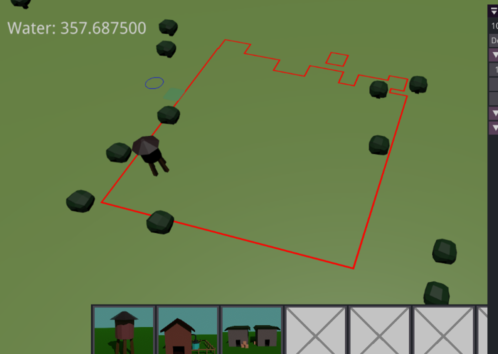

As a student, __I can create and adapt a detailed plan for my project__, so that I take steps towards my dream career in a structured way.

# 💭 Suggested Evidence
- Week 1 self-study plan
- Weekly progress reviews
- Group meeting attendance
- Roundtable survey

# 💯 Detailed Rubric

🔴 **Poor:** The student has handed in their study plan on time. The plan is complete and has acceptable content.

🟠 **Insufficient:** The student has processed teacher feedback on the initial study plan. The student has attended most study-group meetings. The Learning Log section for this ILO contains a progress review for most weeks.

🟡 **Sufficient:** The student has proactively participated in all study-group meetings. Each week, the Learning Log contains a progress review with an actionable plan for the upcoming week.

🟢 **Good:** The student has evaluated their study plan over time and has adapted it when needed, based on critical self-review and feedback received (e.g. during the study-group meetings).

🔵 **Excellent:** The student reflects well on their developed skills and on their progress towards their dream career. The Learning Log shows critical reflection and lessons learned about managing a study project. 

# 🔍 Evidence

## Week 1️⃣: Self-study plan

*Give an outline of your self-study plan. You don't have to present the complete plan here (you're already handing in the one-pager on Brightspace!), but just repeat the most important points.*

*Job title:* Lead Network Programmer

*Project title:* Networking Bee 

*Week 3 milestone:* Establish a connection between 2 clients via the internet. The connection has to use public IP addresses. Using this connection, write messages to each other.

*Week 5 milestone:* Have a code structure that converts the messages received from clients to information, this information is then displayed on screen as 2 different objects moving and updating simultaneously.

*Week 7 milestone:* A demo is created with the networking engine. This demo works for different programs on the same device, with other people on the LAN and via public IP. The demo is a game you can play with (a) friend(s).

*Stress tests:* Sending a lot of packages that are very big (For example: 100.000 Packages with size of 10.000 Bytes ==  1 GB), then I can test how fast my code handles this. On some parts I do not have any control on how fast they are, but for the other parts I can see how fast they handle it and thus improve them.

*Stretch goals:* 
-Connect via STUN server 
-Make physics between players or with objects that can move.  
-Make a fun game with the demo. 

## Week 2️⃣: Progress meeting

*Make sure you can give a live demo of your project during the weekly meeting. Paste a screenshot/video here.* 

Dont have anything yet.

*What have you been doing over the past week? How much time did it take?*

Researching networking, just watching videos / reading papers

*What problems/challenges (foreseen or unforeseen) did you run into?*

none.

*What are you planning to do in the upcoming week?*

Learn more about winsock2 and try to integrate it already.

*Are you on track overall? Do you need to adjust your milestones / stress tests (either up or down)? If so, what are your new milestones / stress tests?*

I am currently on track, but I will probably adjust my milestones when I am done researching.

*Do you have any technical questions you need help with? If so, what are they?*

No.

## Week 3️⃣: Progress meeting

*Make sure you can give a live demo of your project during the weekly meeting. Paste a screenshot/video here.* 

    

*What have you been doing over the past week? How much time did it take?*

Each day I have been researching about this topic.
 I have read https://beej.us/guide/bgnet/ until chapter 8. This is the code I am going to use.
 I learned about UDP hole punching because of the NAT.
 This all took the whole week to do. 
 On Monday I began setting up the project which did not go succesfull.

*What problems/challenges (foreseen or unforeseen) did you run into?*

The researching took a bit longer than I expected since I really wanted to know what I was doing.
 On Monday I wanted to start with the code, but I did not think adding STUN was this hard to do.
  I had to install many different things, such as OpenSSL, this I tried using nmake, but I got a bluescreen.
So the files did not all succesfully make.

*What are you planning to do in the upcoming week?*

Succesfully integrate STUN into the code.
 Setting up most of the code, to the point where I am able to finish my first milestone.

*Are you on track overall? Do you need to adjust your milestones / stress tests (either up or down)? If so, what are your new milestones / stress tests?*

I am a bit behind on schedule since I needed to already have some code.
This I do not have. 

*Do you have any technical questions you need help with? If so, what are they?*

Maybe on how to fix the bluescreen from happening.

## Week 4️⃣: Progress meeting

*Make sure you can give a live demo of your project during the weekly meeting. Paste a screenshot/video here.* 

In this gif I have 2 programs up and running, in one I define that I am the host, in the other I say that I am a client. (Note the 0 or 1).
Then I send messages via the client to the host.
This is all on LAN.

    

*What have you been doing over the past week? How much time did it take?*

**Until Wednesday** I tried to get [PJPROJECT](https://github.com/pjsip/pjproject) up and running. 
 I spend way to much time on this. Then I came to conclusion that it could be easier. 
 I searched for just a little while, and found out that I can easily retrieve my public IPV4. I wrote the program from someone online [StackOverflow question](https://stackoverflow.com/questions/39566240/how-to-get-the-external-ip-address-in-c). 
  This worked and as you can see, I retrieved my own IP.

    

This day I also made a task list.

 **Thursday**  I did just a little research, we had not much time that day.

 **Friday** I made a program using the code from beej, which is just winsock code.
 I finally achieved connection between 2 programs, although it was LAN...

 **Monday** I wanted to fill in the first technical question.
 This helped me a lot with understanding ways to connect p2p. 
 Although I had planned to just use IPV6 for connection, it made me realize I probably still need to do hole punching for the firewall. I also came to conclusion that I did not even need STUN or TURN for IPV4, that I still could do hole punching. 
 Filling in this technical question just helped me a lot with understanding what my plan is.

*What problems/challenges (foreseen or unforeseen) did you run into?*

In the beginning of the week I still did a lot of useless work with setting up the PJPROJECT. I should have done a step back and think about it. 

*What are you planning to do in the upcoming week?*

I want to have a connection through the internet. Using IPV6, I also want to find a good way of testing this (I.E. rent a laptop).

Start thinking or even programming on how to send and read the data and to use it in code.

*Are you on track overall? Do you need to adjust your milestones / stress tests (either up or down)? If so, what are your new milestones / stress tests?*

Yes, I adjusted my milestones a bit. They were a bit broad and not telling enough of what I want to accomplish. 
Here are the new ones:
 **Week 3**: *"Establish a connection between 2 clients via the internet. The connection has to use public IP addresses. Using this connection, write messages to each other."*

 **Week 5**: *"Have a code structure that converts the messages received from clients to information, this information is then displayed on screen as 2 different objects moving and updating simultaneously."*

 **Week 6**: *"Code must be user-friendly. A demo is created using this code, this demo is a game you can play with friends where you need to control a crowd."* 

The stress test I may want to change, but I am not sure to what.

*Do you have any technical questions you need help with? If so, what are they?*

No.

## Week 5️⃣: Progress meeting

*Make sure you can give a live demo of your project during the weekly meeting. Paste a screenshot/video here.* 

    <video src="../assets/media/ILO1/LAN2Devices.mp4" alt="Sending messages to other devices" width="500" style="margin: -10px 20px 10px 0;"/>

*What have you been doing over the past week? How much time did it take?*

**Wednesday** I tried to use a connection via a virtual machine. It sounded like it could work.
After a while I set it up, but then I saw that the virtual machine uses the same ip.
(Yet I see now that this may not be the case)

**Thursday** Now I rented a laptop from the service desk. I tried connecting to it the whole day without success.
I found out that using 'ping "ip" ' I could check if I can connect to other devices more easily. 
And so I discovered that I just could not connect on the schools wifi. (Possibly because of AP isolation?)

**Friday** I tested it at my room with the rented laptop. This time I could get it to work. I was now able to send messages to other devices on the same network.

**Monday** I made a plan for how to structure my engine.
I made a list with all the functions and researched a technical question.

*What problems/challenges (foreseen or unforeseen) did you run into?*

First that the virtual box was not as rewarding as I thought it would be.
 Secondly connecting on the schools network is maybe not possible or harder, this I have to research, but it will make it a little harder.

*What are you planning to do in the upcoming week?*

I am planning to start with setting up some engine code with the functions I described in my word file.
With this I could already start making a demo slowly.

*Are you on track overall? Do you need to adjust your milestones / stress tests (either up or down)? If so, what are your new milestones / stress tests?*

I feel like I am just a bit behind. 
I may need to adjust week 7 and probably the stress testing.

*Do you have any technical questions you need help with? If so, what are they?*

Is the school using AP isolation?

## Week 6️⃣: Progress meeting

*Make sure you can give a live demo of your project during the weekly meeting. Paste a screenshot/video here.* 

    

    

    

    

*What have you been doing over the past week? How much time did it take?*

**Wednesday** I created a structure where I can send packages and retrieve packages on a fairly easy way.
It was not too difficult to add, but I had to research some stuff about std::any and Agrs...
I tried to connect using IPV6 with a peer. 
After some tries I retrieved the message from him, but this I saw on wireshark. It did not show on the console.

**Thursday** Fixed more of the structure I created on Wednesday. I was quite busy fixing that.

**Friday** I got things on the screen, two players that can interact smoothly with each other.
I also did get the virtual machine working. 

**Holiday** In the holliday I decided to just work on the demo, I did a little networking but not much.
Mostly creating a fun demo to play, I got pretty far with some nice features, but I got ways to go.

*What problems/challenges (foreseen or unforeseen) did you run into?*

I received messages on wireshark from another peer, but they did not show up on the console.
The recvfrom() did not capture anything. 
This I need to research.

*What are you planning to do in the upcoming week?*

Fix the issue with the Public connection not working.
 Add more things to the demo, this includes:  
fixing already existing bugs and  
creating entities and start with their functionality.
 Also work on the ILOs a bit more.

*Are you on track overall? Do you need to adjust your milestones / stress tests (either up or down)? If so, what are your new milestones / stress tests?*

I am pretty on track, but I just need to fill in more ILOs.

I adjusted my milestone for week 7 and a stretch goal:    
**Milestone week 7 before:** "Code must be user-friendly. A demo is created using this code, this demo is a game you can play with friends where you need to control a crowd"
  
**Milestone week 7 after:** "A demo is created with the networking engine. This demo works for different programs on the same device, with other people on the LAN and via public IP. The demo is a game you can play with (a) friend(s)"
   
**Stetch goal before:** "increase total player amount"
  
**Stretch goal after:** "Connect via STUN server"

*Do you have any technical questions you need help with? If so, what are they?*

I stated my problem I have a question about in the 'problems I currently have' but this I just need to research some more.

## Week 7️⃣: Progress meeting

*Make sure you can give a live demo of your project during the weekly meeting. Paste a screenshot/video here.* 

    

    

    

    

*What have you been doing over the past week? How much time did it take?*

**Tuesday** I fixed some issues/bugs, and started with creating some entities.

**Wednesday** Made some improvements in code such as using std::varient instead of std::any. Also gave more thoughts of the entity system.

**Thursday** I added a way to select objects using shader code, this took a long time. Also made some UI for the shelter.

**Friday** Changed entity vector to registry.

**Saturday** + **Sunday** worked on research question. Took me around 2 hours each day.

**Monday** Thought about how to stress test. Tested public connection and got it working.
Made some changes to the networking code.

*What problems/challenges (foreseen or unforeseen) did you run into?*

- The selecting objects took a bit longer then expected. This was due to it needing shader coding, which makes it a bit difficult.

- I spend a lot of time creating the entities and the UI for them. I need to spend more on the ILOs.

- I don't know how to stress test.

*What are you planning to do in the upcoming week?*

- Start writing skeleton of blog to get feedback on.

- Finish last research question

- Do the stress testing

- Add more functionality to my entities

*Are you on track overall? Do you need to adjust your milestones / stress tests (either up or down)? If so, what are your new milestones / stress tests?*

I am currently well on track. I finished all milestones, but I think I will not be able to fully finish my demo. This because the demo is pretty big and I need to focus on ILOs.

I am finally changing my stress testing because now I know how I am going to do it.
 before: 
*Sending a lot of data towards the server/host. I can check how fast the data gets received and send back. Maybe it is also possible to check if someone from further away can connect and how fast that connection is.*
 After: 
*Sending a lot of packages that are very big (For example: 100.000 Packages with size of 10.000 Bytes ==  1 GB), then I can test how fast my code handles this. On some parts I do not have any control on how fast they are, but for the other parts I can see how fast they handle it and thus improve them.*

*Do you have any technical questions you need help with? If so, what are they?*

I do not.
