As a programmer, __I profile and optimize my code using the appropriate tools and techniques__, so that my software works efficiently even in challenging scenarios.

# 💭 Suggested Evidence
- Profiler output -> Descriptions of optimizations -> Improved profiler output
- Videos / code of stress tests
- Analysis of performance / algorithms

# 💯 Detailed Rubric

🔴 **Poor:** Some evidence of profiling the performance of the student's codebase.

🟠 **Insufficient:** Evidence of executing the stress tests as outlined in the plan and profiling them using the appropriate tools, enough to indicate a basic understanding of profiling. 

🟡 **Sufficient:** Evidence of non-trivial optimizations in the codebase based on the profiling results of the stress tests. The student clearly shows their process of profiling, optimizing the code, and verifying the outcome.

🟢 **Good:** The profiling and optimization work clearly looks for the limits of the developed features, e.g. by testing multiple values of multiple relevant parameters. This shows that the student has good insight into the scalability of the system.

🔵 **Excellent:** The work leads to highly optimized code and/or good future optimization opportunities. The student shows a deep understanding of optimization and performance analysis within the project's domain (e.g. algorithmic analysis, hardware constraints, etc).

# 🔍 Evidence

I found it a bit difficult finding out what I wanted to stress test in my project.
 This because the main limits are set by the internet speed on my device.
 I still found ways to stress test my library.

## Package for you, package for me, package for everyone!

For the first test I made a set-up so that I can send lots of packages to another client.
 
**This test is done via my own device towards my own device.
This means the limit is my own devices hardwere,** still I want to include this.

Set-up: 
- I have an imgui window where I can change how many packages I can send and at which size.
- The size stands for how many random numbers I add to the package.
- I will be using wireshark to check the time between the first and last message.
- Using the info I got, I can calculate the speed in MegaBytes Per Second.

Here are the results:

| Amount of packages   | Size of packages  | Time it took to send (in seconds)   |  MBPS   |
|----------------------|-------------------|------------------------|---------|
| 10.000 | 31 | 0,081316 | 3,812 |
| 10.000 | 5724 | 0,323433 | 176,976 |
| 10.000 | 56691 | 2,208962 | 256,641 |
| 100.000 | 25 | 0,78267 | 3,194 |
| 100.000 | 5685 | 3,89143 | 146,090 |
| 100.000 | 56682 | 23,673988 | 239,427 |

Here it is made clear that if I want speed, I should use the size of a package to the fullest.

#### **Public Package**

Now I tested the sending of packages using a public connection. 
This test is only done once.  
The connection is from and to another building in Breda.

| Amount of packages   | Size of packages  | Time it took to send (in seconds)   |  Time it took 1 package with size of 1 byte (in miliseconds)  |
|----------------------|-------------------|------------------------|---------|
| 100 | 444 | 0,01705 | 0,000402ms  |
| 1000 | 456 | 0,179501 | 0,000393ms  |
| 10.000 | 449 | 1,568 | 0,000374ms  |
| 100.000 | 443 | 17,861 | 0,000393ms  |

This time I want to compare the speed of 1 package with 1 byte.
 As seen they are almost all the same speed. This indicates that the amount of packages does not matter on how fast they will be send.

## Code Profiling

Now is the part where we check the code's performance. 

Set-up:
- I will use Superluminal to profile the code.
- During this test I send multiple waves of packages to the device or from the device. Then I check how my functions handle this many packages.

#### **Storing Messages**
How fast does my engine store messages into the received-messages container?

I am looking in the listen() function. This listens to any message that might comes in.
 When one comes in, it will check this message and store it inside a container.

    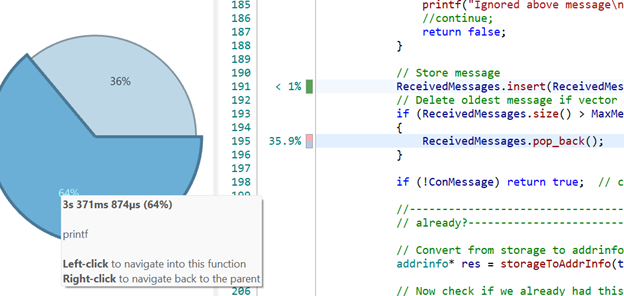
Here I grab a small section where the recvfrom() actually gets data.
 
There were 2 bottlenecks. The printf function and the pop_back().

Removing messages constantly from a vector at the end is pretty bad for the performance.
 So I figured, why not delete in chunks using memset?

    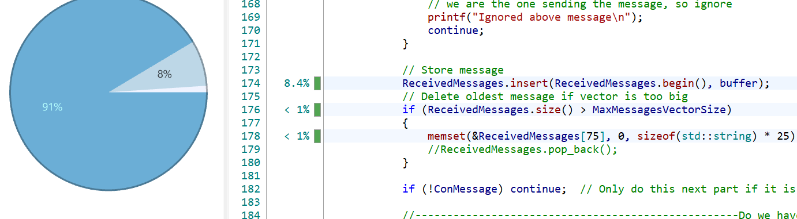
    For this test I checked the whole of the test.
     This means that recvfrom() takes up most of the time.
     I also deleted the printf() function.

Before I could use memset, I needed to preallocate some memory for this vector which I did in the init().
  But as seen, the removing part now is way faster.
  But inserting is a lot slower, remember that at this scale it took 700 ms to insert of the 9.4 seconds inside the function.
  
After a little search, I found out that I could use a deque instead of a vector.
 Thus I changed it.

The result was as following:

    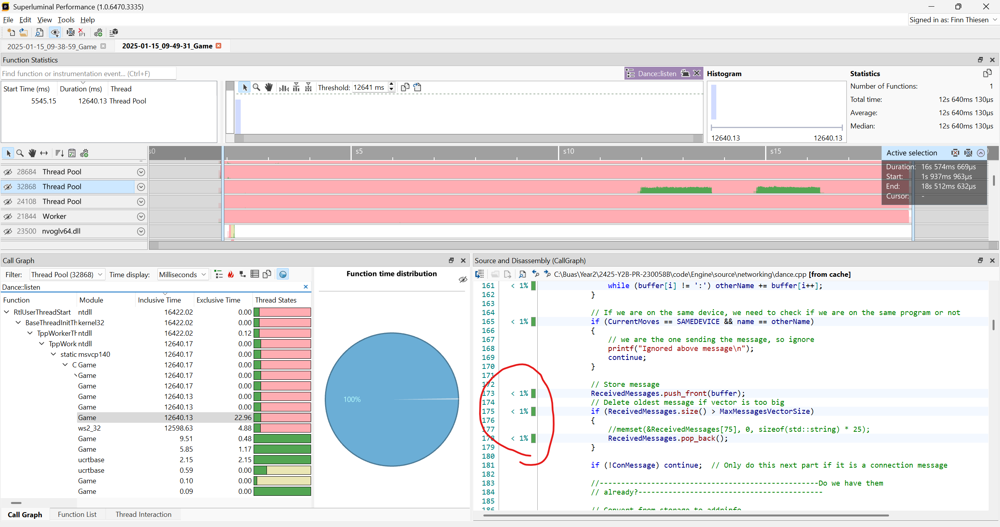

There was now almost no delay anymore with inserting the messages into the container.
 Very succesful improvement.

#### **Receiving Packages**

Now I am looking in the ui.update() function.
This function is at the part where it checks if it received a start notification.
 It is also where I inserted the test packages.

GetIP() took up a lot of time as did the printf().
 I am interested in the getPackage() function.

    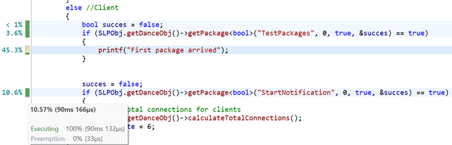
    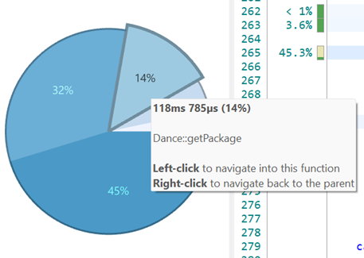

getPackage() here is around 14% of the function.
 Let us take a look inside

    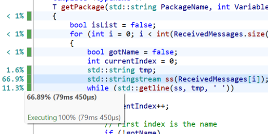
    Pretty obvious that the stringstream is a bit slow.
     I added this to get different words from the string.
     So why not create a custom function that does this for us and see if it is faster.

I did 2 extra tests to check if the performance was better.

    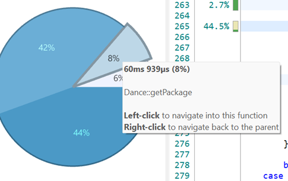
    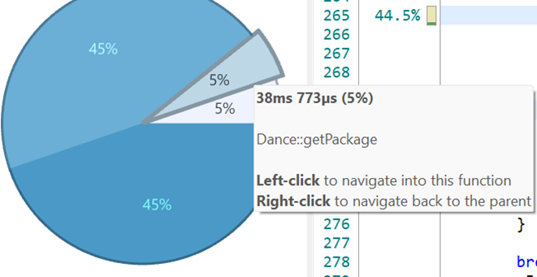

It went from 14% to 8-5 %, a two time increase.
 I also went and removed the printf function:
    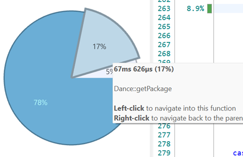

Inside the function I noticed something.

    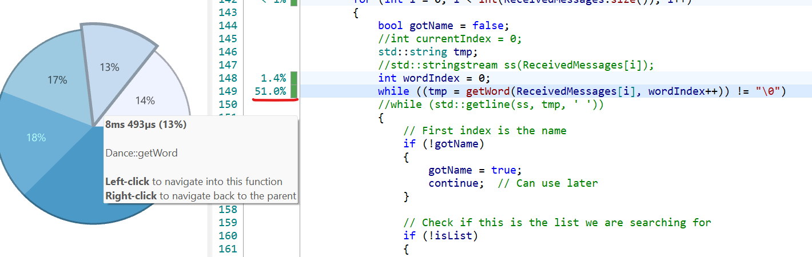
    While the line of the getWord() function is 51%, the function itself is 13%, this means that the other 36% is from copying the string.

I found out that I could use std::string_stream to just pass part of the string I put into the function, this way I never have create a new string and copy/move it around.

    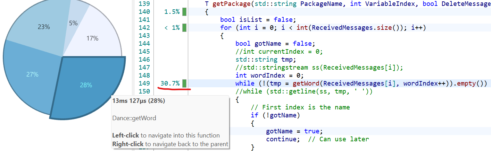
    It went down from 51% to 30.7% with only 2.7% being not from the getWord() function.
      Altough I did notice that the function itself became a bit slower. But all together I improved the speed.

#### **Sending Packages**

This part fluctuates a lot depending on how many packages you send and how big they are.
 In these test I send 100.000 packages with size of 75 (ranging between 439 Bytes and 455 bytes mostly)

    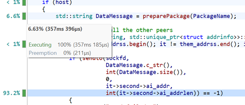
In this case the preparing of the package take 6.6% of the function.
 We can not change the speed whatshoever of the sendto() function.

    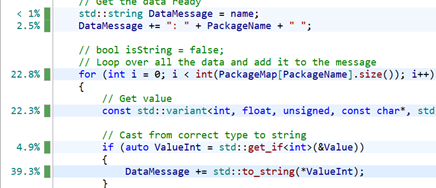
It is pretty clear that the strings are the problem here. 

I have tried some changes to increase the speed. 
First I tried using ostringstream.

    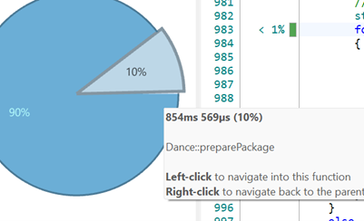
    This made it slower.
     So, we needed something else.

But besides the string problem I added some other improvements.
  such as pre-defining the size for the loop and take a reference of the package instead of needing to look it up in the array every time.
 These two things made it a little bit faster:

    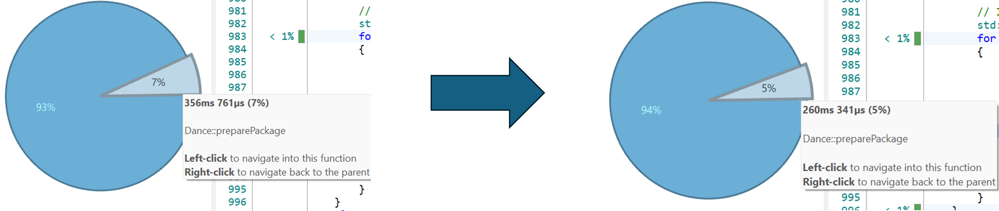

Yet it is still not that fast.
 Thus, I tried something else, this time I thought of using arrays instead of strings. 
 But the problem still relies on the conversion between type to string.
 I tried snprintf() to do this conversion, then I store it inside an array.
 This was the result:

    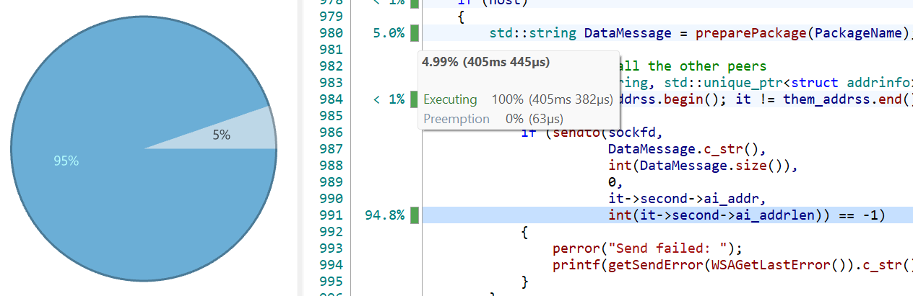

About the same speed.
 But using these arrays made it so I was using more memory, thus the best option was to revert back to strings.

I converted the function to return char* instead of strings. 
This did not make that much of a difference, this because converting from int to char* is very expensive. 
 Here is the snprintf() in question:

    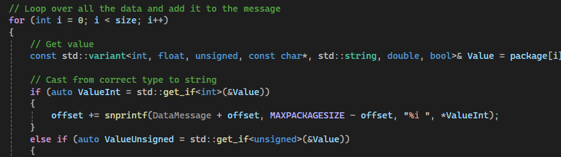

 Result:

    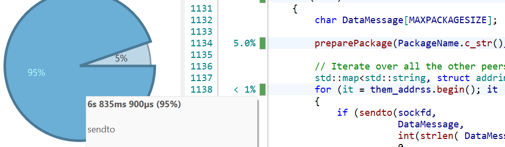

  It does seem pretty small, but when I add more bytes to the package the main problem will be the preparing of the package and not the sending:

    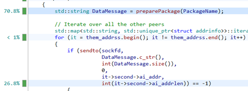

Yet this was the fasted I knew to improve the function.