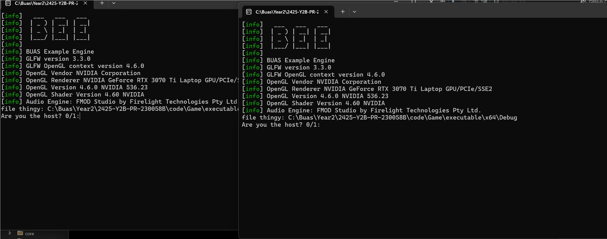
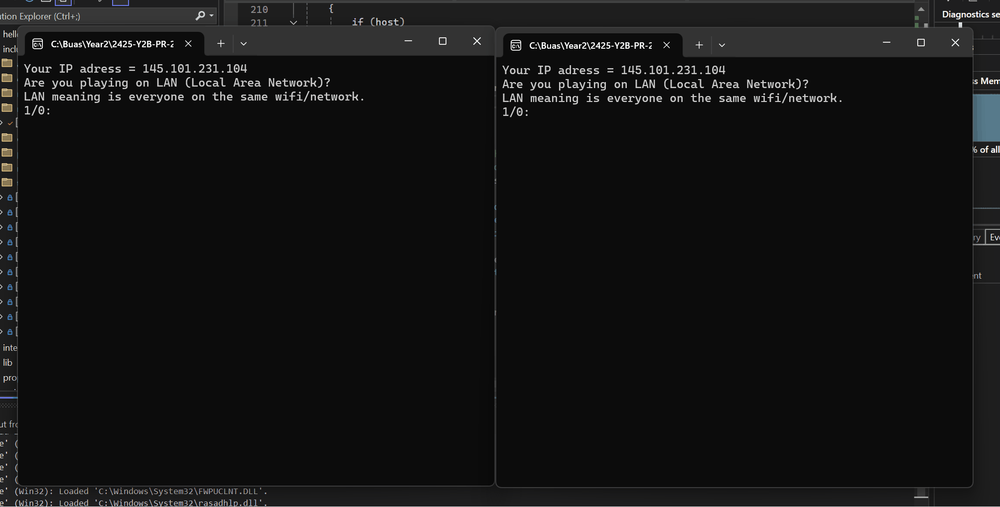
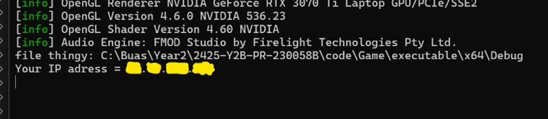
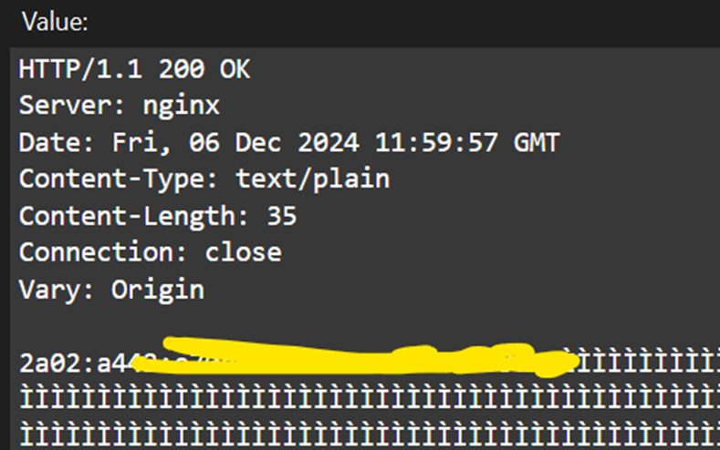
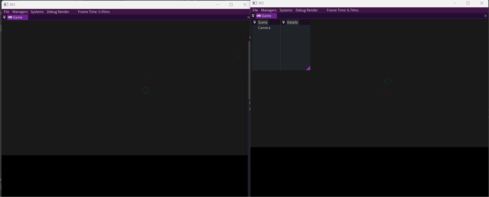

As a game (engine) programmer, __I can create a technically impressive production-ready tool / feature__, so that my work can help shape future projects.

# 💭 Suggested Evidence
- Videos / screenshots of the features developed
- Relevant code snippets
- Explanations of the implemented concepts

# 💯 Detailed Rubric

🔴 **Poor:** Evidence of some development work in line with the self-study plan. The student has written enough code themselves.

🟠 **Insufficient:** Evidence of the project output being a usable tool/feature. Videos and code examples show the project's basic usage and capabilities.

🟡 **Sufficient:** Evidence of the project output having all the functionality mentioned in the self-study plan, for example by showing multiple demos. The work has been sufficiently complex.

🟢 **Good:** Evidence of the tool/feature being easy to embed into other projects, using well-designed APIs and clear examples of usage. Evidence shows good technical execution in terms of software architecture, algorithms, data structures, error handling, etc.

🔵 **Excellent:** Videos and other evidence show that the student's code is robust and well-tested. The student has significantly pushed the boundaries of the project, by investigating and solving complex domain problems on their own.

# 🔍 Evidence


In my study plan, I wrote that I wanted a public connection between 2 clients. 
<br>These clients would then send messages to each other.

I did not succeed this milestone, I did have a connection between 2 players, but this was via the same device.

*In this video I have 2 programs open, I use my networking code to connect to the other window.
<br>This I use to send messages.*
<div style="display: flex; justify-content: center; align-items: center; gap: 20px; margin: 0 auto;">
    
</div>

*This is an improved version where I can write messages from and to both ends.*
<div style="display: flex; justify-content: center; align-items: center; gap: 20px; margin: 0 auto;">
    
</div>


To connect to other device I had to improve my code, this time I had to use IPs.
<br>Altough I did not need a public IP for LAN, I need one for the public connection.
<br>So, I found a way to retrieve this IP in code.
<br><br> The problem was that your own device can only see your private IP, to get your public IP, you need a connection from outside your NAT (Router). 
<br>I found online a very good way to do this; You send a request message to a site (api64.ipify.org).
<br>This site will then send a response back with your public IP, if you support IPV6, it will return that otherwise it will return an IPV4.
<br><br>
<div style="display: flex; justify-content: center;">
Here I was able to retrieve my public IPV4 and IPV6
</div>
<div style="display: flex; justify-content: center; align-items: center; gap: 20px; margin: 0 auto;">
    
        
</div>
<br><br>    
After this I created connection via LAN (same network) on two different devices.
<br>This was almost the same code, but I needed to use private IPs.
<div style="display: flex; justify-content: center; align-items: center; gap: 20px; margin: 0 auto;">
    <video src="../assets/media/ILO1/LAN2Devices.mp4" alt="Video of 2 devices sending messages" width="800" controls autoplay muted preload="auto" style="margin: -10px 20px 0px 0;">
    </video>
</div>
**If video is hanging / does not work, you may download it.** 
<br><br>

In the meantime, I worked on my week 5 milestone. 
<br>For this I had to have for each player an object that moves simultaneously on each screen.

*Here is the result, watch the green and red circle moving*
<div style="display: flex; justify-content: center; align-items: center; gap: 20px; margin: 0 auto;">
    
</div>

During the holiday I wanted to start with my demo, I implemented UI for my networking, a map and items you can place. 

*This video shows me placing objects, these objects will show up on the other screen due to being connected.*
<div style="display: flex; justify-content: center; align-items: center; gap: 20px; margin: 0 auto;">
    
</div>

I added some more features to my demo, such as selecting objects and interacting with the UI.

*In this gif I place a shelter and a barrack. In the shelter I buy entities. These then will load.
<br>After they are done loading they show up in the barrack where you will need to train them for a certain time.*
*Note the outlines around the objects created using stencil testing*
<div style="display: flex; justify-content: center; align-items: center; gap: 20px; margin: 0 auto;">
    
</div>

Coming back to connecting via the public network.
<br>This was pretty hard to test since I need another device in another network.
<br>Thus needing to ask peers to help.
<br>I asked Loek I we tried to connect multiple times. 
It would not work, but the messages came in on my device, this I could see using a network debugger called wireshark.
<br>After some time I realized what could be the mistake, I changed it and here is the result:

*In this gif I create a lobby, after some time a connection comes in, I start the game. Looking at the other player's region I see structures being placed by him.*
<div style="display: flex; justify-content: center; align-items: center; gap: 20px; margin: 0 auto;">
    
</div>
This was done using our IPV6, this is handy, because it does not need to go through the NAT.
<br>It does however need to go through a firewall, which worked.
<br>The way it works is by using holepunching: *You 'punch' a whole in someones firewall or NAT by sending a message to the other public IP thus saying we trust this network, but we expect a message back since we send one. 
<br>The other network then sends a message through the hole we just created causing the message to go through. A connection has been made.
<br>The timings are crucial here so it could fail on some attempts.* 
<br><br> *I then tried it again for IPV4, I thought this would not work since it also had to go through the NAT, the next gif proved me wrong:*
<div style="display: flex; justify-content: center; align-items: center; gap: 20px; margin: 0 auto;">
    
</div>

Although my demo is not finished 'yet' I completed every goal I had in mind for this block.
<br><br>


## Usage of Library

Here I will share how this library would be used.

### Setting things up

You only need to include one header file and create a class object.
```cpp
#include "dance.h"

Dance DanceObject;
```

You can decide if you want to use callback functions, these could be handy with getting important packages. But an extra thread will be used.
<br>You could also force IPV4 to be sure everyone can connect if some don't have IPV6.
```cpp
void init(bool UseCallBack, bool ForceIPV4);
```
This init function thus sets these values but also initializes winsock2.

### Connecting

In a connection there is always one host and one or more clients.
Thus someone has to take the role as host.
**The host has to connect before the client**.<br>
```cpp
void Host(DanceMoves moves,
            int MaxConnections,
            const char* Port = 0,
            const std::vector<std::string>& clientsIP = std::vector<std::string>());
```
- 'moves' is an enum between 3 options: Same_Device, LAN or Public.
The connection will be determined based on this value. 
- You can add a maximum of total connection allowed into the network. 
- A port number could be specified. This can also be changed by the programmer internally.
- If a Public network has been chosen, the host has to add the IPs of all clients connected.

```cpp
void Connect(DanceMoves moves, char* hostIP, const char* Port = 0);
```
'Connect' is more or less the same, the only difference is that filling in the hostIP is necessary.

Example:
```cpp
if (host)
{   
    //Always host first
    DanceObj.Host(networkType, maxAmountConnections, 0, clientIPs);
}
else
{
    //Connect second
    DanceObj.Connect(networkType, hostIP, 0);
}
```

### Handling packages

Sending messages between client and host is done using set packages.
These packages almost all have the same format: <br>
*"Name PackageName Value1 Value2 Value3 etc"*
<br>It could also specify for whom, in that case there will also be a *'-ToAll'* or *'-ToCl1'* in front.
<br>The format is not that interesting since it will be mostly handled internally.
This is not the case with the callback function (we will get to this).

**Creating Packages**
<br>You create packages only once. 
```cpp
void CreatePackage(std::string PackageName, Args... args);
```
- First you decide the name of the package, this name is capital sensitive.
- You may or may not already add some parameters

**Adding data to package**<br>
You can still change the package after creating it:
```cpp
void AddParametersToPackage(std::string PackageName, Args... args);
void AddDataToParameter(std::string PackageName, int VariableIndex, T Data);
void DeleteParameterFromPackage(std::string PackageName, int number, bool all);
```
Example
```cpp
//Adding time to package
std::string Time = return_current_time_and_date();

DanceObj.AddParametersToPackage("TimeAndDate", Time);

//Adding 10 random ints to the package
for (int i = 0; i < 10; i++)
{
    DanceObj.AddDataToParameter("Values", i, rand());
}
```
Pretty straight-forward. <br>

**Sending Packages**<br>

Sending the package is as simple.
```cpp
void sendPackage(std::string PackageName);
```
This will send the package to all other peers except yourself. 
<br>You can also send a package to a specific connection.
```cpp
void sendPackageTo(std::string PackageName, int themID, bool OnlyToHost);
```
Every number is a different connection, this is set by the host. Thus if you send it to a specific person, you send it first to the host which then will check to who it will be send.
<br>You can also send to yourself using *'sendToSelf'*.

**Receiving Packages**

```cpp
T getPackage(std::string PackageName, int VariableIndex, bool DeleteMessage, bool* succeeded);
```
- To get a package, you specify the name of the package.
- You say which variable of the package you want (starts at 0)
- State if you want to destroy message after reading it.
- And add a bool which will set to true if the package was succesfully read and a value returned.

You also need to specify what type you want to get.<br>
Example:
```cpp
bool success = false;
std::string timeDate = DanceObj.getPackage<std::string>("TimeAndDate", 0, true, &success);
//We need to check if the return value was succesful. 
if (success)
{
    printf(timeDate.c_str());
}
```
Now we handles everything except the callback functions.

**CallBack Functions** 

First you create your desired function that will handle code when a package arrived.
<br> This function needs to have 1 parameter which is 'std::string& data'
```cpp
DanceObj.CreatePackageCallBackFunction("Values", [this](std::string data) {packetValuesReturned(data); });
```
First you specify for which package you want to call this function.
<br>Using a lambda you can add the function.

The function will be called when this package arrives. This package is also not callable from 'getPackage()'.
<br> It will give a string of data, this data includes the name of the sender and the package name. (not '-ToAll' or '-ToHost')<br>
Example:
```cpp
void gameSystem::packetValuesReturned(std::string data)
{
	int valueArray[10];
	//Luckily we know that we have 10 values, the first 2 words indicate the name and the packageName
	for (int i = 0; i < 10; i++)
	{
		valueArray[i] = DanceObj.dataToVariable<int>(data, i + 2);
		printf("Value %i = %i\n", i, valueArray[i]);
	}
}
```

### Other Functions

There are some extra functions that need to be user or can be handy:

```cpp
/// <summary>If we are using hole punching to connect to another client, 
/// this connection has to stay alive. Thus calling KeepAlive every minute is nessecary.</summary>
void KeepAlive(float deltaTime);

/// <summary>Retrieve the IP of this device, !!Also sets the IP type (IPV4/IPV6)!!</summary>
/// <param name="publicIP">Do we want the public or private IP?</param>
std::string getIP(bool publicIP);

/// <summary>Before calling this function calculateTotalConnections() must have been called.
/// Does not include our own connection</summary>
int getTotalConnections() { return TotalConnections; }

/// <summary>Are we the host?</summary>
bool getIfHost() { return host; }
```
Especially the 'getTotalConnections()' and 'getIfHost()' could be handy.


## Embedding into other projects

I created this library in such a way that it is very easy to add this to other projects.
<br>It is just one header and cpp file. 
<br>The class does not rely on other classes in the engine and is fully self-contained. 
